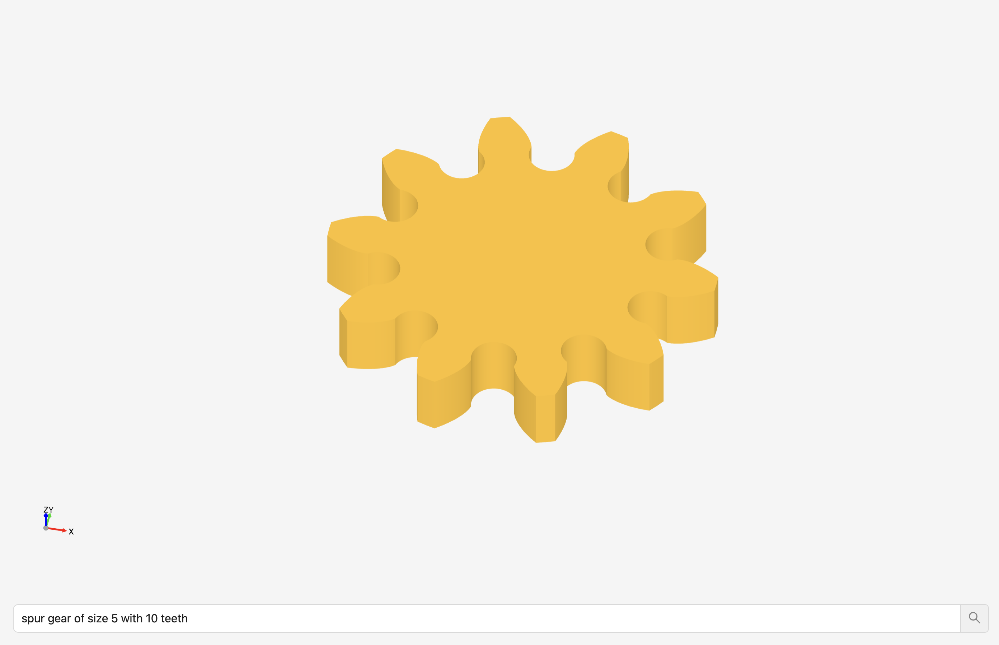

# CQAsk
This tool utilizes Language Models (LLMs) to generate Computer-Aided Design (CAD) models effortlessly.

## Installation

### Frontend
1. Clone this repository.
2. Navigate to the UI library directory.
3. Run `yarn install` to install dependencies.
4. Execute `yarn dev` to start the UI library.

### Backend
1. Ensure you have Python and CadQuery are installed.

    Cadquery dependency install seperately since for some systems conda install is necessary. Please view https://github.com/CadQuery/cadquery if install doesn't work for your system

    `conda install -c conda-forge -c cadquery cadquery=master`

2. Navigate to the backend directory.
3. Run `pip install -r requirements.txt` to install backend dependencies.
4. Add a `.env` file with `OPENAI={OPENAI KEY}`
5. Start the server by running `python api.py`.

## Usage

1. Access the UI via the specified URL after starting the UI library.
2. Input your CAD requirements or specifications.
3. Interact with the tool to generate CAD models using Language Models.
4. All CQ generated files are in the `backend/generated`. Can download STL/STEP/etc in UI
## Features

- Seamless integration of Language Models for CAD generation.
- User-friendly UI for easy interaction.
- Customizable input for CAD specifications.

## License

This project is licensed under the [MIT License](LICENSE.md) - see the LICENSE.md file for details.

